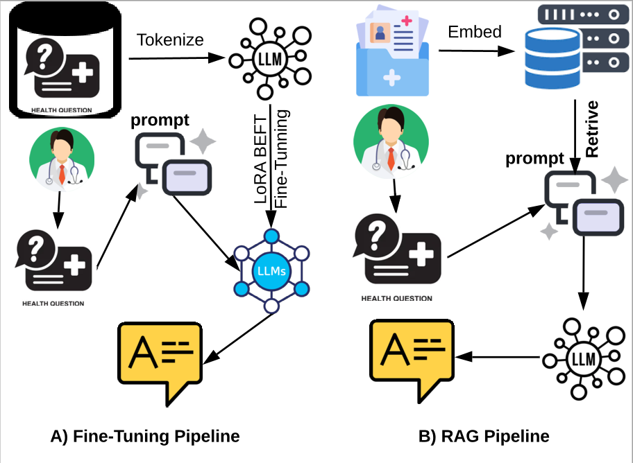

# Medical Question Answring
A Fine tunning + RAG pipline for Medical QA using the MedQA dataset
<br>
[](https://opensource.org/licenses/MIT)
<div align="center">
<br>

<br>
The Medical QA pipelines. A: The SLM Fine-Tuning
pipeline. The SLM is fine-tuned first, then the doctor prompt
the fine-tuned LLM with a medical question. B: The document-
based RAG pipeline. The doctor prompts the non-fine-tuned
LLM, meanwhile, the relevant information for the given ques-
tion is retrieved from a knowledge base and augmented to the
doctor prompt
</div>
 
- Read the detailed report <a href="report/MedQA.pdf" target="_blank" >here</a>. 

## Build conda environment

```bash
    conda create --name MedQA -c conda-forge python=3.11
    conda activate MedQA
    pip install -r requirements.txt
```

## Fine tunning
- Use the colab notebook []( https://colab.research.google.com/drive/1Sl84BvWWWFePH1gxnlwjMcwHusbKVGZG?usp=sharing) and generate the quantized Q4_K_M.gguf quantized version.

or
- Train your model using the command
```bash
    python fine-tune.py --model-name=unsloth/Qwen3-0.6B
```
- Serve the fine-tuned model using <a href="https://github.com/ggml-org/llama.cpp/tree/master/tools/server">llama-cpp server</a>
```bash
    llama-server -m <your_model.gguf> --host <machine_ip> --port <machine_port> -ngl < num_layers_to_offload_into_gpu>
```
    
## Build Faiss Vector DB for RAG
- Build the Faiss vector DB using the colab notebook [](https://colab.research.google.com/drive/15Uq7tDr48x4oWFcAZ-GaC-CYCTX0A8Yf?usp=sharing)

or
- Build the faiss index using the command
```bash
    python RAG.py --build_index=true
```
## Inference
1. Host you model in an LLM inference engine such as <a href="https://ollama.com/library/qwen3:8b">ollama</a> or <a href="https://github.com/ggml-org/llama.cpp/tree/master/tools/server">llama-cpp server</a>
    - list of  Qwen3 Model can be found <a href="https://huggingface.co/collections/Qwen/qwen3-67dd247413f0e2e4f653967f">here.</a>
    - list of fine-tuned models can be found <a href="https://huggingface.co/collections/Qwen/qwen3-67dd247413f0e2e4f653967f">here.</a>
2. Test the fine-tuned model QA:
```bash
    python MedQA.py --model_name=Qwen3-8B --inference_api=http://0.0.0.0:11434/api/generate --test_size=100
```
3. Test the RAG QA:
    - Extract the zip files [data/docs_emb_qwen3.pkl.zip, data/MedQA_en_documents.pkl.zip] if did not build the faiss DB 
```bash
    python RAG.py --build_index=false --model_name=Qwen3-8B --inference_api=http://0.0.0.0:11434/api/generate --test_size=100
```